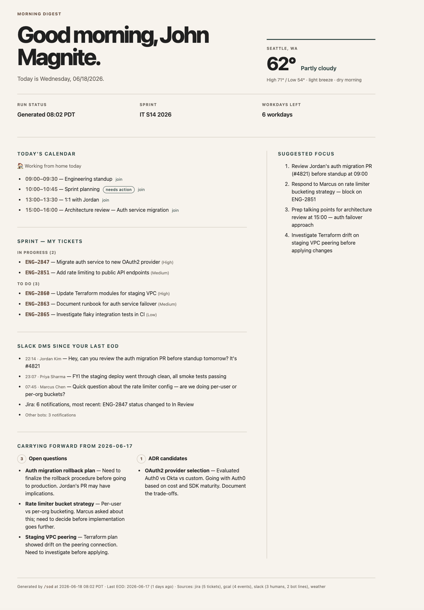

# Daily Briefing Toolkit — SOD & EOD

A ready-to-install toolkit that gives you two daily commands: **SOD (Start of Day)** generates a personalized HTML morning briefing with weather, calendar, news, and task priorities; **EOD (End of Day)** produces a daily summary of what you accomplished, decisions made, and tomorrow's plan.

Works with Claude Code, OpenCode, Hermes Agent, Cursor, or any AI agent that can read Markdown instructions and execute shell commands.



> Open [`sod/demo-sod.html`](sod/demo-sod.html) in a browser to see the full interactive version.

---

## Quick Start

Paste this repo's URL into your AI coding agent and tell it to start with [`SETUP.md`](SETUP.md). It will walk you through an interactive onboarding — picking integrations, entering API keys, and installing everything to the right place. The whole process takes about 5 minutes.

---

## What You Get

**SOD — Morning Digest**
- Today's weather and calendar at a glance
- Jira tickets and GitHub activity
- Slack highlights and news
- All rendered as a single local HTML page that opens in your browser

**EOD — End of Day Summary**
- What you worked on (auto-captured from your coding session, or journal-style)
- Decisions made, blockers hit, links referenced
- Tomorrow's priorities

---

## Manual Setup

If you'd rather set things up yourself without an AI agent, the individual READMEs have everything you need:

- [`sod/README.md`](sod/README.md) — SOD documentation and manual setup
- [`sod/ONBOARDING.md`](sod/ONBOARDING.md) — Step-by-step onboarding checklist
- [`eod/README.md`](eod/README.md) — EOD documentation and setup

---

## Repository Structure

```
SOD-EOD/
├── README.md                       ← You are here
├── SETUP.md                        ← AI agent setup instructions (give this to your agent)
├── sod/
│   ├── README.md                   ← Detailed SOD documentation and manual setup guide
│   ├── ONBOARDING.md               ← Interactive onboarding questionnaire script
│   ├── sod.md                      ← The SOD command itself (Markdown skill/command file)
│   ├── sod-template.html           ← HTML template for the morning briefing output
│   ├── sod-config.example.json     ← Example config with all available options
│   └── demo-sod.html              ← Demo briefing with sample data (open in browser to preview)
└── eod/
    ├── README.md                   ← Detailed EOD documentation and setup guide
    ├── eod.md                      ← The EOD command itself (Markdown skill/command file)
    └── eod-scope.example.json      ← Example config for EOD scope and preferences
```

---

## License

MIT
